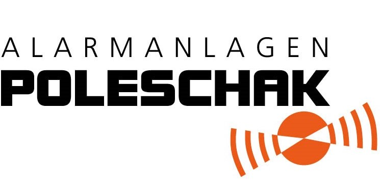

# Phase 1 – Analyse Alarmanlagen Poleschak GmbH

Stand: 29.09.2026. Quellen: Website, Impressum, Zertifikatsseite, Blog, Microsite
videoueberwachung-ingolstadt.de, ausbildung.de, Kununu, Das Örtliche, Branchenquellen
(Links unten). **(offen)** = konnte ich nicht prüfen.

---

## 1. Steckbrief

| | |
|---|---|
| Firma | Alarmanlagen Poleschak GmbH, HRB 7663, AG Ingolstadt |
| Sitz | Horchstraße 3, 85080 Gaimersheim; zweiter Standort Pfaffenhofen a. d. Ilm |
| Führung | Dipl.-Kffr. Sabine Poleschak, Geschäftsführerin in 2. Generation; seit 07/2026 im IHK-Regionalausschuss Eichstätt |
| Gründung | 1975, 2025 50-jähriges Jubiläum |
| Schwesterfirma | SWD Sicherheits- und Wachdienst GmbH (40 Jahre) |
| Größe | Website: 58 Spezialisten, 5.500 Kunden, 13.200 Projekte. ausbildung.de: 25 Mitarbeitende (vermutlich ohne SWD) |
| Leistungen | Einbruchmelde-, Funkalarm-, Video-, Brandmelde-, Zutrittskontroll- und Schließanlagen, 24-h-Notruf-Service-Leitstelle, Alarmverfolgung, Wachdienst/Objektschutz |
| Kunden | Privatkunden; Gewerbe, Handel, Industrie; öffentliche und kirchliche Einrichtungen; Banken und Sparkassen (z. B. Sparkasse Ingolstadt Eichstätt) |
| Zertifikate | VdS 3403 (Errichter für EMA und Video, bis 2029), DIN EN 16763, DIN 14675 (Brandmeldeanlagen), DIN EN ISO 9001 (bis 2029), Autorisierter Telenot-Stützpunkt, BHE-Mitglied seit 25 Jahren, BVMW-Mitglied |
| Ausbildung | Elektroniker/in für Energie- und Gebäudetechnik, Fachkraft für Schutz und Sicherheit; 90 % Übernahmequote |
| Offene Stellen | Servicetechniker Sicherheitstechnik, Mitarbeiter Notruf-Service-Leitstelle, Einsatzleiter Sicherheitsdienst, Sicherheitsmitarbeiter |
| Claim (Website) | „Warten Sie nicht mehr auf Sicherheit, wir bringen diese direkt zu Ihnen!“ |
| Karriere-Claim | „Werde Teil der Familie Poleschak!“ |

---

## 2. Das Alleinstellungsmerkmal

**Die komplette Sicherheitskette aus einer Hand: Planung → Einbau → 24-h-Leitstelle → Wachdienst vor Ort.**

Die regionalen Wettbewerber decken meist nur den Einbau ab. Poleschak (mit SWD) hat
auch die Leitstelle und eigenes Wachpersonal. Das ist gleichzeitig die stärkste
Story für Kunden („Wenn nachts der Alarm losgeht, sind wir es, die rausfahren“)
und für Bewerber (spannende, abwechslungsreiche Jobs, auch nachts).

Dazu kommen **50 Jahre Familienunternehmen** und VdS-Anerkennung, also Vertrauen,
das Versicherungen und Banken bestätigen.

---

## 3. Ist-Zustand online

| Kanal | Befund |
|---|---|
| **Instagram** @alarmanlagenpoleschak | **(offen)**. Instagram sperrt automatische Abrufe. Follower, Beitragszahl, Frequenz und Reels brauche ich von dir (Screenshot vom Profil und von den Insights der letzten 90 Tage). |
| Facebook | ca. 150 Follower (laut Suchmaschine, Datum unklar) |
| LinkedIn | 17 Follower |
| Website-Blog | ca. 1 Beitrag alle 1–2 Monate, mit Lücken (Dez. 2025 → Mai 2026 → Juli 2026) |
| Google-Profil Gaimersheim | **5,0 ★ bei 17 Bewertungen**: stark, aber wenige |
| Google-Profil Pfaffenhofen | nicht gefunden **(offen)** |
| SWD (Google) | 3,8 ★ bei 12 Bewertungen |
| Kununu (Arbeitgeber) | **3,0 ★ bei 5 Bewertungen** (Branche 3,7). Lob: Kollegenzusammenhalt, Weiterbildung. Kritik: Gehalt/Benefits |

### Auffälligkeiten auf der Website (schnell zu beheben, wichtig für den Pitch)
Wer von Instagram auf die Website kommt, sieht Folgendes:
- **Widersprüchliche Firmenalter:** Im Text steht „38 Jahre Erfahrung“, der Zähler zeigt 48, die Microsite 42. Tatsächlich sind es 51 Jahre (Gründung 1975).
- Im FAQ steht „Ausbildung **ab September 2023**“, das ist veraltet. Außerdem ist eine FAQ-Frage doppelt, einmal davon mit „AAP“.
- Im Footer steht „© 2024“.
- Die Galerie enthält nur Jubiläumsfotos, keine Bilder von Team, Technik, Fahrzeugen oder Einsätzen.
- Die Ausbildung zum Elektroniker ist auf ausbildung.de ausgeschrieben, im eigenen Bewerbungsportal aber nicht sichtbar **(bitte prüfen)**.

→ Kein Social-Media-Thema im engeren Sinn. Aber Instagram schickt Menschen auf die
Website, deshalb gehört das als „Quick Win“ in den Masterplan.

---

## 4. Wettbewerb

| Wettbewerber | Instagram | Einordnung |
|---|---|---|
| Pfättisch Sicherheitstechnik, Ingolstadt (seit 1837) | ca. 1.059 Follower, 28 Beiträge | Größter regionaler Account. Wenige Beiträge, Follower vermutlich über Folgen gegen Zurückfolgen gewonnen |
| BLOCKALARM (Partnernetz, auch Region IN) | ca. 886 Follower, 672 Beiträge | Viele Beiträge, wenig Reichweite: Masse allein bringt nichts |
| NeuVision Sicherheitstechnik, Pollenfeld (EI) | (offen) | WhatsApp-Kontakt, klares Einzugsgebiet |
| A & B Alarm- u. Brandmeldesysteme, Ingolstadt | kein Account gefunden | 5 ★ bei 6 Bewertungen |
| IN-Sicherheitstechnik, Ingolstadt | kein Account gefunden | TÜV-zertifiziert |
| Beyl, SECTRA, AVT, Aumüller | – | Überregional, konkurrieren nur über Google-Ortsseiten |

**Fazit:** Kein Sicherheitstechnik-Betrieb in der Region nutzt Instagram ernsthaft.
**Die Nische ist frei.** Mit 1.000 bis 1.500 echten, regionalen Followern wäre
Poleschak schon Nummer 1 in der Region.

### Vorbilder aus dem Handwerk (Recruiting über Social Media)
- **Vögel GmbH** (Elektro/Haustechnik, Allgäu): über 120.000 Follower auf TikTok und ca. 18.000 auf Instagram, authentische Handyvideos. 5 Mitarbeitende investieren je 1–2 Stunden pro Woche. Social Media ist ihr **wichtigster Recruiting-Kanal**.
- **Dachdecker Schultheis** (Hessen): ca. 3.000 Follower, 3 Videos pro Woche, **6 Azubis seit 2023 über Social Media**.

---

## 5. Marke: was schon da ist

| Rolle | Farbe | HEX | Herkunft |
|---|---|---|---|
| Primär | **Signal-Orange** | `#EB5A1B` | Logo (Alarmsymbol), Website |
| Primär | **Schwarz** | `#010101` | Logo-Schriftzug |
| Akzent hell | Orange hell | `#FF7F22` | Website |
| Akzent dunkel | Rostbraun | `#722C0D` | Website |
| Neutral | Anthrazit | `#222222` / `#3C3C3C` | Website |
| Neutral | Mittelgrau | `#545559` / `#B4B5BB` | Website |
| Neutral | Hellgrau | `#F4F4F4` | Website |
| Neutral | Weiß | `#FFFFFF` | |

- **Schrift auf der Website:** Poppins. Sie ist kostenlos und in Canva vorhanden, damit eignet sie sich gut als Hausschrift für Social Media.
- **Logo:** „ALARMANLAGEN“ in dünner, weit gesperrter Schrift, „POLESCHAK“ in sehr fetter, eckig-runder Display-Schrift, daneben das orange Alarmsignal mit Schallwellen. Das Symbol mit den Wellen eignet sich hervorragend als **wiederkehrendes Grafikelement** (Profilbild, Rahmen, Übergänge in Reels).
- **Bewertung:** Orange und Schwarz sind auffällig, energisch und in der Region nicht belegt. Das passt zu Alarm und Signal. Eine Neuentwicklung ist nicht nötig. Gefehlt hat bisher nur ein **Regelwerk**: welches Orange wofür, welche Bildsprache, welche Vorlagen.

---

## 6. SWOT

| Stärken | Schwächen |
|---|---|
| 50 Jahre Familienunternehmen, 2. Generation | Kaum Reichweite (FB ca. 150, LinkedIn 17) |
| Komplette Kette inkl. Leitstelle und Wachdienst | Unregelmäßiger Content, Website teils veraltet |
| VdS, DIN 14675, ISO 9001, Telenot-Stützpunkt | Kununu 3,0 (Gehalt/Benefits) |
| 5,0 ★ Google, Referenzen (Sparkassen, Kommunen, Kirchen) | Nur 17 Google-Bewertungen, Pfaffenhofen ohne Profil (?) |
| 90 % Übernahme der Azubis, „Familie Poleschak“ | Bildmaterial bisher nur vom Jubiläum |

| Chancen | Risiken |
|---|---|
| Nische in der Region frei | **Sicherheitsbranche:** keine Kundenobjekte, Adressen, Kamerapositionen oder Systemdetails zeigen (Diskretion ist Teil des Markenversprechens) |
| Einbrüche steigen: PKS 2025 Deutschland 82.920 Fälle (+5,7 %), Bayern 3.806 (+5,6 %) | Fachkräftemangel: 24 % der Lehrstellen im Handwerk Oberbayern bleiben unbesetzt |
| 44,9 % der Einbrüche scheitern im Versuch → „Sicherung wirkt“ als Content | Negative Arbeitgeberbewertungen können durch mehr Sichtbarkeit auffallen |
| Ø-Schaden 3.850 € pro Einbruch (GDV, Rekord) | Personenfotos nur mit schriftlicher Einwilligung (DSGVO/KUG) |
| Förderung: KfW-Kredit 159, § 35a EStG (20 % der Arbeitskosten) | Zeitaufwand wird unterschätzt → Plan muss realistisch sein |
| Einbruch-Saison ab Zeitumstellung (25.10.2026), Start des Masterplans passt genau | |
| Recruiting über Reels im Handwerk nachweislich erfolgreich | |

**Wichtig:** Das KfW-Zuschussprogramm 455-E gibt es seit Ende 2023 nicht mehr.
In Posts sollten wir nur den Kredit 159 und § 35a nennen.

---

## 7. Zielgruppen-Vorschlag (zum gemeinsamen Festlegen)

| # | Zielgruppe | Warum | Instagram geeignet? |
|---|---|---|---|
| A | **Eigenheimbesitzer/innen 35–65** in den Landkreisen IN, EI, PAF, ND | Größter Hebel für Anfragen, emotionales Thema „Sicherheit der Familie“ | ✅ sehr |
| B | **Azubis 15–19 + Eltern** (Elektroniker/in EG, Fachkraft Schutz & Sicherheit) | Größter Engpass, Reels wirken | ✅ sehr (Eltern eher über Facebook) |
| C | **Fachkräfte/Quereinsteiger** (Servicetechniker, Leitstelle, Sicherheitsdienst) | 4 offene Stellen | ✅ gut, dazu gezielte Anzeigen |
| D | Gewerbe/KMU (Praxen, Handel, Handwerk) | Hohe Auftragswerte | ⚠️ mittel, eher über LinkedIn und Google |
| E | Öffentliche Hand, Banken | Ausschreibungen, Netzwerk | ❌ Instagram nur zur Imagepflege |

**Mein Vorschlag:** Instagram konzentriert sich auf **A + B + C**. D und E profitieren
indirekt, weil ein professioneller Auftritt Vertrauen schafft. LinkedIn kommt als
„Stufe 2“ in den Ausblick.

---

## 8. Was ich noch von dir brauche

1. **Instagram-Zahlen:** Screenshot vom Profil und von den Insights (letzte 90 Tage: Reichweite, Follower, Top-Beiträge).
2. **„Dominique“:** Laut einem Suchergebnis gibt es einen Fotografen, Filmer und Social-Media-Manager namens Dominique. Bist du das, oder ist das eine andere Person bzw. Agentur? Davon hängt die Argumentation im Pitch ab.
3. **Deine aktuellen Stunden und dein Stundenlohn**, oder soll ich mit Marktwerten rechnen? Social Media Manager in Ingolstadt verdienen im Schnitt ca. 3.000 € brutto pro Monat in Vollzeit.
4. **Stimmen die 58 Mitarbeitenden** (mit SWD?) bzw. die 25 bei Poleschak?
5. **Wie viele Azubis** gibt es aktuell, und wie viele sollen pro Jahr eingestellt werden?
6. **Zielgruppen A + B + C** so übernehmen?
7. **Material:** Logo als Vektor (SVG, AI oder EPS), Team-, Fahrzeug- und Leitstellenfotos.

---

## Quellen
- Website & Impressum: https://alarmanlagen-poleschak.de, /impressum, /zertifikate, /bewerbungsportal, /news
- Microsite: https://www.videoueberwachung-ingolstadt.de
- Ausbildung: https://www.ausbildung.de/unternehmen/alarmanlagen-poleschak-gmbh/stellen/
- Kununu: https://www.kununu.com/de/alarmanlagen-poleschak
- Google-Bewertungen via Das Örtliche: https://www.dasoertliche.de/Themen/Poleschak-Alarmanlagen-Gaimersheim-Horchstr
- PKS 2025 Bayern: https://www.stmi.bayern.de/presse-und-medien/pressemitteilungen/detail/herrmann-stellt-kriminalstatistik-2025-vor-21375/
- PKS 2025 Deutschland: https://www.baulinks.de/webplugin/2026/0571.php4
- GDV 2025: https://www.gdv.de/gdv/medien/medieninformationen/wohnungseinbrueche-schaeden-steigen-auf-380-millionen-euro-198570
- Förderung: https://www.lupus-electronics.de/de/blog/foerderung-fuer-einbruchschutz
- Vögel GmbH: handwerk-magazin.de (09.05.2025); Schultheis: hessenschau.de (02.05.2025)
- Instagram-Benchmarks: https://www.socialinsider.io/social-media-benchmarks/instagram
- Gehalt: gehaltsvergleich.com (Ingolstadt), StepStone Gehaltsreport 2026
- Ausbildungsvergütung Elektrohandwerk Bayern: https://cgm.de/news/elektrohandwerk-bayern-2025/
